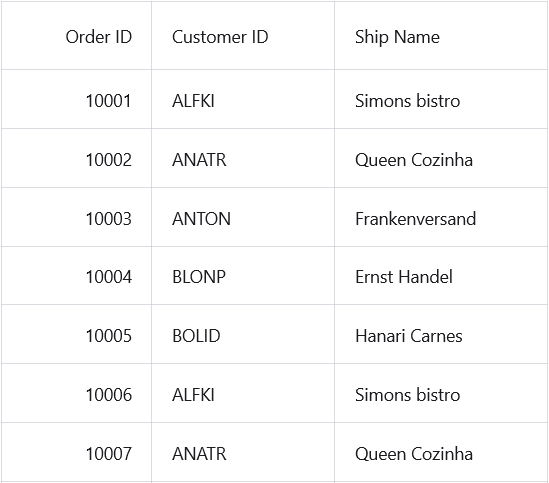

# How to bind the ItemSource from a JSON file in a MAUI DataGrid?
The [.NET MAUI DataGrid](https://www.syncfusion.com/maui-controls/maui-datagrid) supports binding the item source from a local JSON file.

##### C#
Create a **JSON** data model.

**OrderInfo**
```C#
public class OrderInfo
{
    public int OrderID { get; set; }
    public string? CustomerID { get; set; }
    public int EmployeeID { get; set; }
    public double Freight { get; set; }
    public string? ShipCity { get; set; }
    public bool Verified { get; set; }
    public DateTime OrderDate { get; set; }
    public string? ShipName { get; set; }
    public string? ShipCountry { get; set; }
    public DateTime ShippedDate { get; set; }
    public string? ShipAddress { get; set; }
}
```
Please place the JSON file in the 'Resources\raw' folder and ensure that the file's property is set as 'MauiAsset'.

**OrderInfoViewModel**

Read the JSON file using the **FileSystem.OpenAppPackageFileAsync()** method and deserialize the JSON object using the [Newtonsoft.Json](https://www.nuget.org/packages/Newtonsoft.Json) package.

```C#
const string templateFileName = "OrderInfo.Json";   

public async void LoadFile()
{
    this.OrdersInfoCollection = new List<OrderInfo>();
    using (var stream = await FileSystem.OpenAppPackageFileAsync(templateFileName))
    using (var reader = new StreamReader(stream))
    {
        this.OrdersInfoCollection = JsonConvert.DeserializeObject<List<OrderInfo>>(await reader.ReadToEndAsync())!;
    }

}
```

The following screenshot shows how to bind Itemsource from a JSON file in SfDataGrid.



[View sample in GitHub](https://github.com/SyncfusionExamples/How-to-bind-the-ItemSource-from-a-JSON-file-in-a-MAUI-DataGrid)

Take a moment to pursue this [documentation](https://help.syncfusion.com/maui/datagrid/overview), where you can find more about Syncfusion .NET MAUI DataGrid (SfDataGrid) with code examples.
Please refer to this [link](https://www.syncfusion.com/maui-controls/maui-datagrid) to learn about the essential features of Syncfusion .NET MAUI DataGrid(SfDataGrid).

### Conclusion
I hope you enjoyed learning about how to bind Itemsource from a JSON file in SfDataGrid.

You can refer to our [.NET MAUI DataGrid's feature tour](https://www.syncfusion.com/maui-controls/maui-datagrid) page to know about its other groundbreaking feature representations. You can also explore our .NET MAUI DataGrid Documentation to understand how to present and manipulate data.
For current customers, you can check out our .NET MAUI components from the [License and Downloads](https://www.syncfusion.com/account/downloads) page. If you are new to Syncfusion, you can try our 30-day free trial to check out our .NET MAUI DataGrid and other .NET MAUI components.
If you have any queries or require clarifications, please let us know in comments below. You can also contact us through our [support forums](https://www.syncfusion.com/forums), [Direct-Trac](https://support.syncfusion.com/account/login?ReturnUrl=%2Faccount%2Fconnect%2Fauthorize%2Fcallback%3Fclient_id%3Dc54e52f3eb3cde0c3f20474f1bc179ed%26redirect_uri%3Dhttps%253A%252F%252Fsupport.syncfusion.com%252Fagent%252Flogincallback%26response_type%3Dcode%26scope%3Dopenid%2520profile%2520agent.api%2520integration.api%2520offline_access%2520kb.api%26state%3D8db41f98953a4d9ba40407b150ad4cf2%26code_challenge%3DvwHoT64z2h21eP_A9g7JWtr3vp3iPrvSjfh5hN5C7IE%26code_challenge_method%3DS256%26response_mode%3Dquery) or [feedback portal](https://www.syncfusion.com/feedback/maui?control=sfdatagrid). We are always happy to assist you!